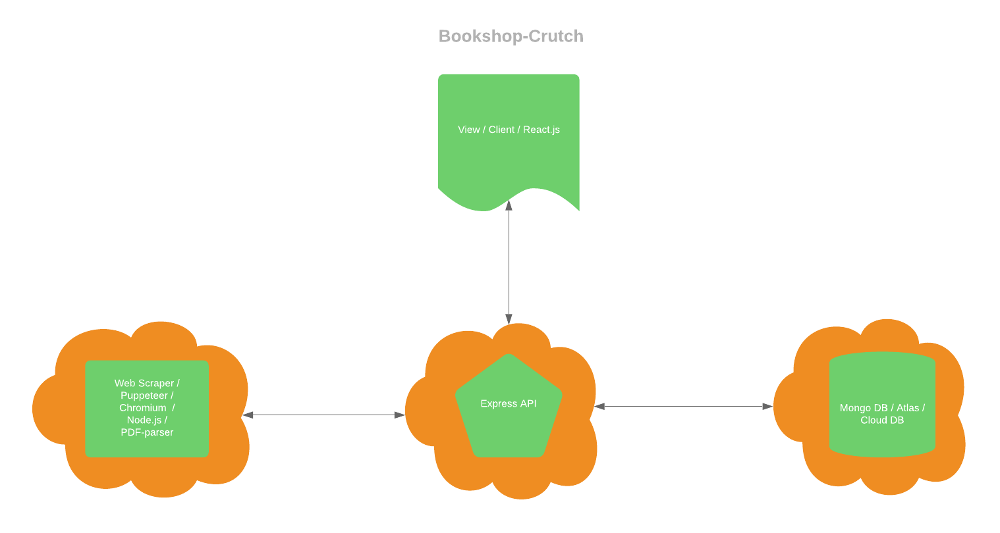

# Bookshop-Crutch
Bookshop-Crutch is a customer service assistance tool that aggregates a customer's order information and displays it in one place. I decided to build this for myself while working as a contractor for Bookshop, after realizing how cumbersome the process was to get the information I needed. The data was not only spread out accross different websites, but also required navigating through a dated customer portal and parsing through a PDF file in order to find the relavent information. This app cuts a 6+ step process down to one.

## 🚨 This is a proprietary tool!
This project is honestly not meant to be forked/cloned. I've kept this repo private until now because the company that this was made for has changed their workflow significantly enough that having this public shouldn't be problem. 

## 🛠 🚀 Installation & Set Up
1. In order to set this up locally (which I am hoping you don't try to do) you'll need to first make sure you have the latest version of [Node](https://nodejs.org/en/) installed.

2. Clone the repository.
3. You'll need to install all the modules for each service, so in the terminal cd into each folder - scraper, client, api - and run:
    ```sh
    npm install
    ```
4. You'll need to start the express server, so create a new terminal tab and cd into the api folder and run:
    ```sh
    npm start
    ```
5. You'll also need to start the server for the front end, so create a new terminal tab and cd into the client folder and also run:
     ```sh
    npm start
    ```
### 📝 NOTE

To watch the scraper service navigating a chromium instance, you can open up the code in your favorite code editor and do a global search for "headless". Follow the instructions provided by the comment in the "login.js" file.

## 🤖 Tech Used

Client Service / View
- React.js (create-react-app)

Web Scraper Service
- Puppeteer (with Chromium)

Users Service
- Express.js

Database (a stretch goal)
- MongoDB / MongoDB Atlas

### Architecture


### 📝 Stretch Goals
- Utilize MongoDB and expand the users service
- Completely decouple the users service from the web scraper service
- Make optimizations for the web scraper service
- Incorporate UPS & USPS web API's
- Deploy to AWS


